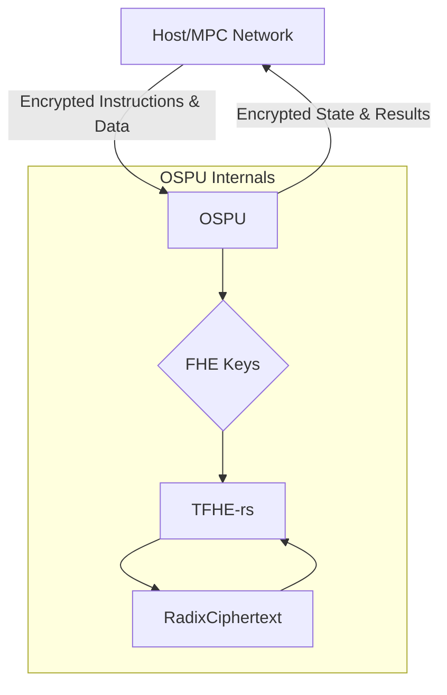
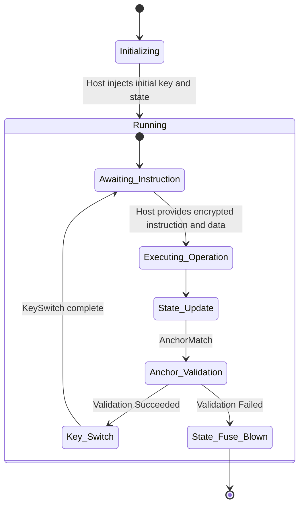

# Ouroboros Secure Processing Unit (OSPU) - Technical Whitepaper PoC

## 1. Project Overview

The Ouroboros Secure Processing Unit (OSPU) is an autonomous key management state machine based on Fully Homomorphic Encryption (FHE). Its core objective is to achieve autonomous management of key materials, state transitions, and policy enforcement **within the FHE encrypted domain**. The OSPU is designed to guarantee the uniqueness and causal integrity of its logical state while providing architectural support for future physical unclonability.

### 1.1. Design Philosophy

The OSPU's design is rooted in the concept of **Self-Verifying State Evolution**, eliminating reliance on external validators or global consensus mechanisms.

- **Logical Root of Trust**: The OSPU acts as a cryptographic black box, autonomously managing its internal core secrets (like the ClientKey), which never leave the OSPU's computational boundary in plaintext.
- **Causal Integrity and State Isolation**: Drawing inspiration from Decentralized State Machines (DSM), each state of the OSPU is cryptographically anchored to the previous state via a hash chain. The validity of state transitions is independently verified by the OSPU internally through FHE circuits, achieving bilateral state isolation from the external world (Host).
- **Minimal Attack Surface**: The OSPU exposes only a highly restricted, non-Turing-complete Instruction Set Architecture (ISA). All operations are predefined, fundamentally eliminating entire classes of vulnerabilities associated with general-purpose computing.
- **Trust Delegation**: Complex operations requiring external collaboration (such as multi-party key generation) are designed to be delegable to external systems. In the PoC phase, this role is fulfilled by the Host; in a complete system, it will be handled by decentralized components like Multi-Party Computation (MPC) networks and Zero-Knowledge Proof (ZKP) systems.

### 1.2. Core Architecture

### 1.3. Trust Model

| Component | Secrets Held | Trust Assumption | Security Technology |
| :--- | :--- | :--- | :--- |
| **OSPU** | Plaintext ClientKey/ServerKey | Logical state is unique, computation is confidential | TFHE-rs encrypted domain, specialized ISA |
| **Host** | Plaintext ServerKey | Trusted in PoC phase, observes all I/O | - |
| **MPC Network** | Distributed Key Shares | Goal for the full system, replaces the Host | MPC Protocols (Future Integration) |
| **Physical Security** | - | Physical unclonability | DBRW Hardware Binding (Future Integration) |

## 2. Registers and Data Representation

All internal encrypted registers of the OSPU are implemented using **TFHE-rs**'s `integer::RadixCiphertext` type. This representation decomposes a large integer into smaller blocks (digits), with each block encrypted by an LWE ciphertext.

Based on the in-depth benchmarks from `tfhe-rs-handbook.md`, to achieve the optimal balance between performance and functionality, the OSPU will default to a **2-bit message + 2-bit carry** block encoding scheme (`PARAM_MESSAGE_2_CARRY_2_KS_PBS`).

| Register Name | Width | Description |
| :--- | :--- | :--- |
| `CK_reg` | 256b | Encrypted representation of the current ClientKey |
| `NCK_reg` | 256b | Encrypted buffer for the new ClientKey |
| `INT_CTR_reg` | 32b | Internal state transition counter |
| `EXT_MR_reg` | 128b | Merkle root anchor for external world state |
| `FLAGS_reg` | 8b | Flags to control OSPU behavior |
| `IN_reg` | 64b | General-purpose input register |
| `OUT_reg` | 64b | General-purpose output register |
| `TMP_reg` | 128b | Temporary computation register |

## 3. Instruction Set Architecture (ISA)

The OSPU's instruction set is non-Turing-complete. All operations are carefully designed for efficient and secure execution in an FHE environment.

### 3.1. Base ISA

| Instruction | Operands | Description | FHE Implementation Notes |
| :--- | :--- | :--- | :--- |
| `LOAD` | `dest_reg, ciphertext` | Loads external encrypted data into a register | Ciphertext assignment, no PBS |
| `OUT` | `src_reg` | Outputs the content of a register | Ciphertext copy, no PBS |
| `ADD` | `dest, src1, src2` | Homomorphic addition | Uses TFHE-rs's parallel carry propagation algorithm |
| `SUB` | `dest, src1, src2` | Homomorphic subtraction | Implemented as `a + (-b)`, leveraging parallel carry propagation |
| `MUL` | `dest, src1, src2` | Homomorphic multiplication | Based on the Schoolbook algorithm, decomposed into B² inter-block bivariate PBS |
| `INC_CTR` | `counter_reg` | Increments a counter | `server_key.scalar_add(1)`, efficient with low noise growth |
| `CMP` | `dest_bit, src1, src2` | Homomorphic comparison | `server_key.eq()`, implemented via multiple PBS |
| `MUX` | `dest, cond, true, false` | Homomorphic multiplexer | `server_key.if_then_else()`, a PBS-based selection operation |

### 3.2. Special ISA

| Instruction | Operands | Description | FHE Implementation Notes |
| :--- | :--- | :--- | :--- |
| `AnchorMatch` | `exp_mr, exp_ctr` | Verifies the external state anchor | Performs parallel homomorphic comparisons on `EXT_MR_reg` and `INT_CTR_reg`, followed by a homomorphic AND on the results |
| `KeySwitch` | `new_ck_plaintext` | Switches the ClientKey | **PoC Phase**: Plaintext loading. **Future**: Will evolve into an FHE circuit, possibly inspired by DLV, for conditional updates in the encrypted domain |

## 4. Core Workflow and FHE Implementation Guide

### 4.1. Lifecycle Explained

### 4.2. Core Principles of FHE Implementation

- **Performance Optimization - Parallelism**: FHE computations (especially PBS) are the performance bottleneck. For data-parallel operations (like the comparisons on multiple register blocks in `AnchorMatch`), it is **mandatory** to use the `rayon` library's parallel iterators (`par_iter`) to fully leverage multi-core CPU resources.
- **Noise Management**: The OSPU implementation will rely entirely on the atomic operations provided by TFHE-rs (e.g., `add`, `mul`, `if_then_else`). These high-level APIs internally encapsulate the necessary `KeySwitch-PBS` (KS-PBS) procedures, automatically managing noise growth and refreshing, thus freeing the developer from manually inserting bootstrapping operations.
- **Security - Logical and Physical**:
    - **Logical Security**: OSPU's state transitions are enforced by `AnchorMatch`, ensuring state continuity and tamper-resistance, which forms the logical root of trust.
    - **Physical Security (Future)**: The DBRW (Dual-Binding Random Walk) algorithm will be integrated. It achieves physical anti-cloning capabilities by extracting device-unique hardware entropy (e.g., memory timings) and binding it to the OSPU's encrypted state.

## 5. Design Challenges and Future Outlook

| Challenge | PoC Solution | Full System Goal |
| :--- | :--- | :--- |
| **Key Switching** | Host plaintext injection + state re-encryption | Use an MPC network for distributed key generation and switching, or implement an FHE-based conditional key update circuit. |
| **State Anchor Verification** | Simplified homomorphic comparison | Introduce ZKPs (e.g., STARKs) to allow the Host to verify the correctness of the `AnchorMatch` operation without accessing any secrets. |
| **Physical Unclonability** | Relies on logical state uniqueness guarantees | Integrate the DBRW algorithm to cryptographically bind the OSPU's encrypted state to a specific hardware's physical fingerprint. |
| **Performance Bottlenecks** | Limit operation bit-width, parallelize with `rayon` | Evaluate and integrate the `tfhe-rs-cuda` backend for GPU acceleration, or explore the possibility of dedicated hardware (FPGA/ASIC). |

## 6. Test Plan

1.  **Unit Tests**:
    - **Instruction-level Correctness**: Verify that the FHE implementation result of each instruction matches the plaintext computation result.
    - **Noise Boundary Testing**: Design test cases to explore the behavior of operations at critical noise levels.
2.  **Integration Tests**: Follow the core workflow to test the complete end-to-end process from initialization to key switching, including fault injection tests.
3.  **Performance Benchmarks**:
    - Measure the execution latency of critical instructions (`MUL`, `CMP`, `AnchorMatch`).
    - Analyze memory footprint.

> **Warning**: This project is a Proof of Concept (PoC) and contains experimental cryptographic implementations. It has not undergone a comprehensive security audit and is strictly forbidden for use in any production environment.
