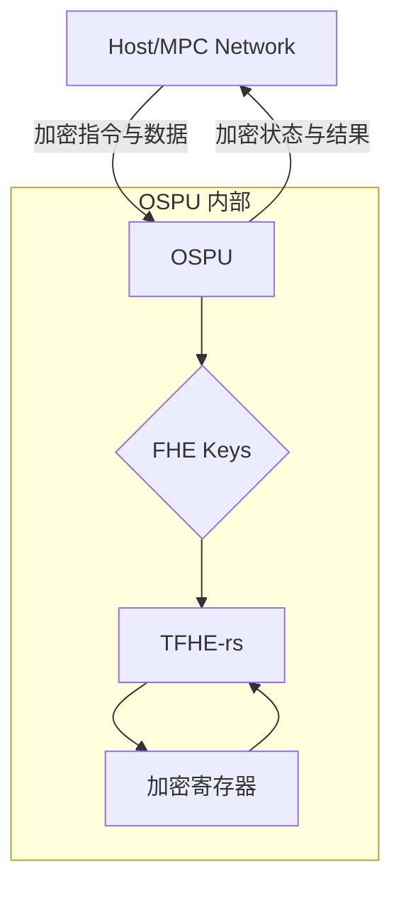
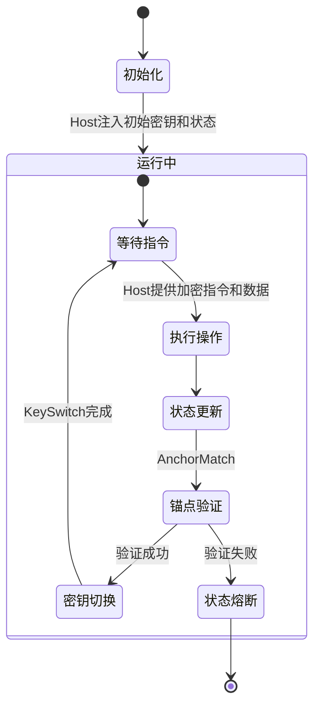

# Ouroboros Secure Processing Unit (OSPU) - 技术白皮书 PoC

## 1. 项目概述

Ouroboros 安全处理单元 (OSPU) 是一个基于全同态加密 (FHE) 的自主密钥管理状态机。其核心目标是在 **FHE 加密域内**实现密钥材料的自主管理、状态转换和策略执行。OSPU 的设计旨在保证其逻辑状态的唯一性和因果完整性，同时为未来的物理不可复制性提供架构支持。

### 1.1. 设计哲学

OSPU 的设计根植于**自验证状态演进 (Self-Verifying State Evolution)** 的理念，摆脱了对外部验证器或全局共识机制的依赖。

- **逻辑信任根**: OSPU 作为一个密码学黑盒，自主管理其内部的核心秘密（如 ClientKey），这些秘密永远不会以明文形式离开 OSPU 的计算边界。
- **因果完整性与状态隔离**: 借鉴去中心化状态机 (DSM) 的思想，OSPU 的每个状态都通过哈希链与前一个状态加密锚定。状态转换的有效性由 OSPU 内部通过 FHE 电路独立验证，实现了与外部世界（Host）的双边状态隔离。
- **最小攻击面**: OSPU 仅暴露一个高度受限的、非图灵完备的指令集架构 (ISA)。所有操作都经过预定义，从根本上消除了与通用计算相关的漏洞类别。
- **信任委托**: 复杂的、需要外部协作的操作（如多方密钥生成）被设计为可委托给外部系统。在 PoC 阶段，此角色由 Host 承担；在完整系统中，将由多方计算 (MPC) 网络和零知识证明 (ZKP) 系统等去中心化组件承担。

### 1.2. 核心架构

### 1.3. 信任模型

| 组件 | 秘密持有 | 信任假设 | 安全保障技术 |
| :--- | :--- | :--- | :--- |
| **OSPU** | 明文 ClientKey/ServerKey | 逻辑状态唯一，计算过程保密 | TFHE-rs 加密域, 专用指令集 |
| **Host** | 明文 ServerKey | PoC 阶段可信，观察所有输入输出 | - |
| **MPC 网络** | 分布式密钥分片 | 完整系统目标，替代 Host | MPC 协议 (未来集成) |
| **物理安全** | - | 物理不可复制性 | DBRW 硬件绑定 (未来集成) |

## 2. 寄存器与数据表示

OSPU 内部所有加密寄存器均采用 **TFHE-rs** 的 `integer::RadixCiphertext` 类型实现。这种表示方法将一个大的整数分解为多个较小的块（digits），每个块由一个 LWE 密文加密。

根据 `tfhe-rs-handbook.md` 的深入基准测试，为在性能和功能间取得最佳平衡，OSPU 将默认采用 **2-bit 消息 + 2-bit 进位** 的块编码方案 (`PARAM_MESSAGE_2_CARRY_2_KS_PBS`)。

| 寄存器名 | 位宽 | 描述 |
| :--- | :--- | :--- |
| `CK_reg` | 256b | 当前 ClientKey 的加密表示 |
| `NCK_reg` | 256b | 新 ClientKey 的加密缓存 |
| `INT_CTR_reg` | 32b | 内部状态转换计数器 |
| `EXT_MR_reg` | 128b | 外部世界状态的 Merkle 根锚点 |
| `FLAGS_reg` | 8b | 控制 OSPU 行为的标志位 |
| `IN_reg` | 64b | 通用输入寄存器 |
| `OUT_reg` | 64b | 通用输出寄存器 |
| `TMP_reg` | 128b | 临时计算寄存器 |

## 3. 指令集架构 (ISA)

OSPU 的指令集是非图灵完备的，所有操作都经过精心设计，以在 FHE 环境中高效、安全地执行。

### 3.1. 基础指令 (Base ISA)

| 指令 | 操作数 | 功能描述 | FHE 实现说明 |
| :--- | :--- | :--- | :--- |
| `LOAD` | `dest_reg, ciphertext` | 加载外部加密数据到寄存器 | 密文赋值，无 PBS |
| `OUT` | `src_reg` | 将寄存器内容作为输出 | 密文复制，无 PBS |
| `ADD` | `dest, src1, src2` | 同态加法 | 使用 TFHE-rs 的并行进位传播算法 |
| `SUB` | `dest, src1, src2` | 同态减法 | 实现为 `a + (-b)`，利用并行进位传播 |
| `MUL` | `dest, src1, src2` | 同态乘法 | 基于 Schoolbook 算法，分解为 B² 次块间二元 PBS |
| `INC_CTR` | `counter_reg` | 计数器递增 | `server_key.scalar_add(1)`，高效且噪声增长小 |
| `CMP` | `dest_bit, src1, src2` | 同态比较 | `server_key.eq()`，通过多次 PBS 实现 |
| `MUX` | `dest, cond, true, false` | 同态选择器 | `server_key.if_then_else()`，基于 PBS 的选择操作 |

### 3.2. 特殊指令 (Special ISA)

| 指令 | 操作数 | 功能描述 | FHE 实现说明 |
| :--- | :--- | :--- | :--- |
| `AnchorMatch` | `exp_mr, exp_ctr` | 验证外部状态锚点 | 对 `EXT_MR_reg` 和 `INT_CTR_reg` 进行并行同态比较，然后对结果进行同态 AND |
| `KeySwitch` | `new_ck_plaintext` | 切换 ClientKey | **PoC 阶段**: 明文加载。**未来**: 演变为 FHE 电路，可能受 DLV 启发，实现加密域内的条件更新 |

## 4. 核心工作流程与 FHE 实现指南

### 4.1. 生命周期详解

### 4.2. FHE 实现核心原则

- **性能优化 - 并行化**: FHE 计算（特别是 PBS）是性能瓶颈。对于数据并行的操作（如 `AnchorMatch` 中对多个寄存器块的比较），**必须**使用 `rayon` 库的并行迭代器 (`par_iter`) 来充分利用多核 CPU 资源。
- **噪声管理**: OSPU 的实现将完全依赖 TFHE-rs 提供的原子操作（如 `add`, `mul`, `if_then_else`）。这些高级 API 内部封装了必要的 `KeySwitch-PBS` (KS-PBS) 流程，自动管理噪声增长和刷新，开发者无需手动插入引导操作。
- **安全性 - 逻辑与物理**:
    - **逻辑安全**: OSPU 的状态转换由 `AnchorMatch` 强制执行，确保了状态的连续性和防篡改性，构成了逻辑上的信任根。
    - **物理安全 (未来)**: 将集成 DBRW (Dual-Binding Random Walk) 算法，通过提取设备唯一的硬件熵（如内存时序）并将其与 OSPU 的加密状态绑定，实现物理层面的抗克隆能力。

## 5. 设计挑战与未来展望

| 挑战 | PoC 解决方案 | 完整系统目标 |
| :--- | :--- | :--- |
| **密钥切换** | Host 明文注入 + 状态重加密 | 使用 MPC 网络进行分布式密钥生成和切换，或实现基于 FHE 的条件密钥更新电路。 |
| **状态锚点验证** | 简化的同态比较 | 引入 ZKP (如 STARKs)，允许 Host 在不访问任何秘密的情况下，验证 `AnchorMatch` 操作的正确性。 |
| **物理不可复制性** | 依赖逻辑状态的唯一性保证 | 集成 DBRW 算法，将 OSPU 的加密状态与特定硬件的物理指纹进行加密绑定。 |
| **性能瓶颈** | 限制操作位宽，利用 `rayon` 并行化 | 评估并集成 `tfhe-rs-cuda` 后端以利用 GPU 加速，或探索专用硬件 (FPGA/ASIC) 的可能性。 |

## 6. 测试计划

1.  **单元测试**:
    - **指令级正确性**: 验证每条指令的 FHE 实现结果与明文计算结果一致。
    - **噪声边界测试**: 设计测试用例，探索操作在临界噪声水平下的行为。
2.  **集成测试**: 遵循核心工作流程，测试从初始化到密钥切换的完整端到端流程，并包括错误注入测试。
3.  **性能基准**:
    - 测量关键指令（`MUL`, `CMP`, `AnchorMatch`）的执行延迟。
    - 分析内存占用。

> **警告**: 本项目为概念验证 (PoC)，包含实验性的密码学实现，未经全面安全审计，严禁用于任何生产环境。
